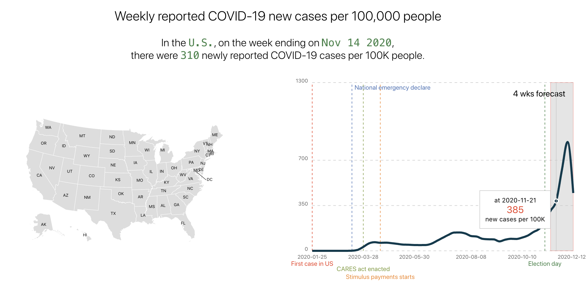
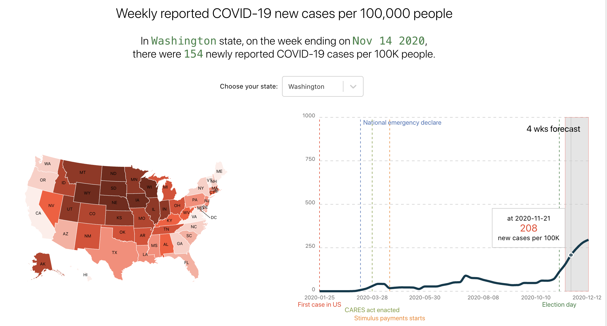
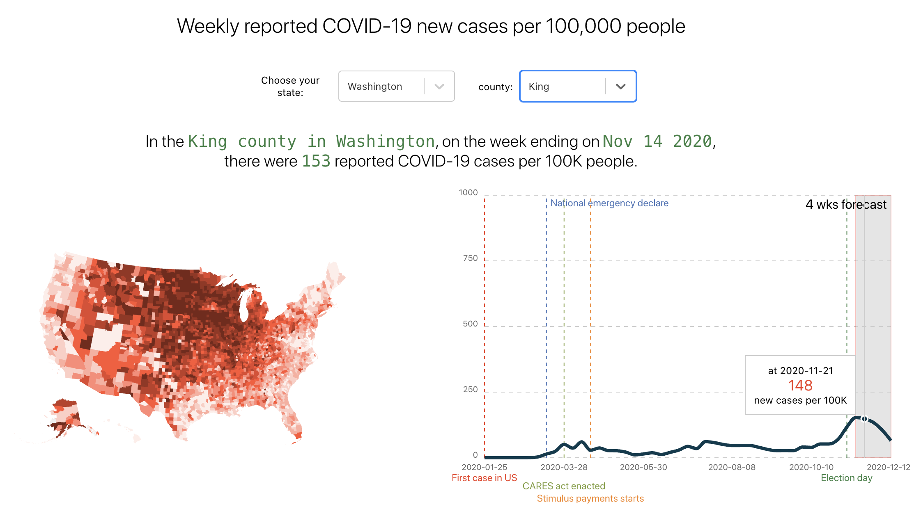

# One Quiet Night

`One Queit Night` develops scientifically-driven machine learning models to accurately predict the spread of COVID-19 infections using real-time data from the [C3 AI COVID-19 Data Lake](https://c3.ai/customers/covid-19-data-lake/). `One Quiet Night` forecasts the number of new Covid-19 cases per week for the next 4 weeks at the national, state, and county levels.

`One Quiet Night` built an intuitive web application to show our forecasts with `React`, `React-Simple-Maps`, and `ReChart` for data visualization.

## Forecasts

### Forecasts on the week 11-14-2020

- National level
  

- State level : Washington state (WA)
  

- County level : King county
  

## Testing

Use Docker for local builds

```sh
docker run --rm -it -p 3000:3000 $(docker build -q .)
```

## Deployment

Deploy react app with [`GitHub Pages`](https://create-react-app.dev/docs/deployment/#github-pages).

```sh
npm run deploy
```

## Vaccine eligibility to the general public (https://www.cnn.com/2021/03/30/health/states-covid-19-vaccine-eligibility-bn/index.html)

Below is the timeline for when those and other states have said they will open vaccination eligibility to the general public:
-- March 9: Alaska
-- March 16: Mississippi
-- March 22: West Virginia
-- March 24: Utah and certain state-run sites in Arizona
-- March 25: Georgia
-- March 29: Oklahoma, Texas, Ohio, North Dakota, Louisiana and Kansas
-- March 30: Minnesota, Arkansas
-- March 31: Indiana, South Carolina
-- April 1: Montana, Connecticut
-- April 2: New Hampshire, Colorado
-- April 5: Michigan, Tennessee, Idaho, Iowa, Florida, Nevada, Wisconsin, Alabama
-- April 6: New York, Delaware, Maryland
-- April 7: North Carolina, Maine
-- April 9: Missouri
-- April 12: Illinois, Kentucky
-- April 15: California, Washington
-- April 18: Virginia
-- April 19: Vermont, Massachusetts, Rhode Island, Pennsylvania, Washington, D.C.
-- April, no set date: New Mexico, Wyoming
-- May 1: Oregon, South Dakota, Nebraska, Hawaii, New Jersey
